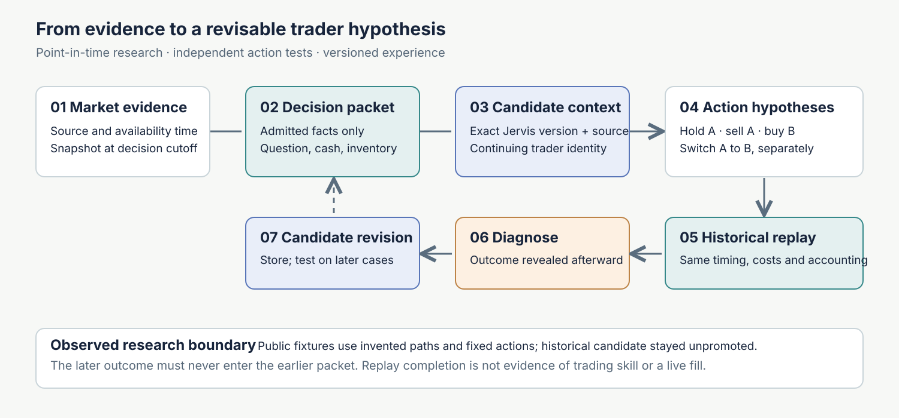

# Puretelligence · research before a trading decision



**Research question.** Can a continuing trader learn from historical cases without confusing information known at decision time with later outcomes, or treating a good idea as a profitable trade?

**System design.** Puretelligence is the public research presentation of the Guanlan architecture. It owns market evidence, information cutoffs, simulation and diagnosis. Jervis owns source-linked candidate experience and scoped worker context. Lu Dongyangzi is the continuing trader identity across research cases. A research decision tests sell, buy and switch separately under the same cash, inventory, cost and timing assumptions.

**Reproducible result.** The public source slice runs the original snapshot, replay, diagnosis, research-context, candidate-manifest and run-record modules on invented data. A second synthetic experiment resolves exact candidate and source versions through Jervis's real Registry before a fixed-action retest. One price path shows why B beating cash does not imply that switching from A beats holding A; another invented path reverses the comparison.

**Evidence boundary.** These fixtures test architecture contracts, not learned trading ability. The historical local trader completed a diagnostic exam, targeted study and retest; its candidate revision remained unpromoted. No public fixture recreates that private worker run, and no live fill or sustained profit is claimed.

[Inspect the experiment and limits](docs/research-case.md) · [Inspect the Jervis version bridge](docs/jervis-bridge.md) · [Read the historical research case](https://github.com/Cornelius-Chen/Cornelius-Chen/blob/main/cases/quant.md)

## Try the complete research path

Requires Python 3.12+. From a fresh clone:

```bash
python -m venv .venv
# Windows: .venv\Scripts\activate
# macOS/Linux: source .venv/bin/activate
python -m pip install '.[test,jervis]'
python examples/run_research_cycle.py
python examples/run_experience_bridge.py
python -m pytest -q
```

The example writes inspectable artifacts to `.demo/research/`: a market snapshot and information cutoff, replay and diagnosis, research-context revisions, a **candidate only** manifest, a run record, and `result.json`. Use `--output <empty-directory>` to choose another output location. The example refuses to overwrite an existing run.

The synthetic result is deliberately uncomfortable: **B beats cash, but switching A into B trails holding A.** Existing cash can buy B without selling A. This is why the trader's sell, buy, and switch judgments must be evaluated independently under the same accounting assumptions.

The second command uses an **exact pinned public Jervis release**. It creates a separate Registry in `.demo/experience-bridge/`, saves a synthetic source and three candidate versions, resolves an old and a revised version by ID, verifies their attachments and cutoffs, then runs four fixed-action comparisons on another invented price path. Read `experience_versions.json`, `decision_packet.json`, and `retest.json` in that order. The later path happens to favor switching; neither result measures trader skill. [Follow the version binding and its limits](docs/jervis-bridge.md).

## Engineering evidence in the public slice

| Boundary | Original module used in this release | Visible artifact |
| --- | --- | --- |
| **Evidence and cutoff** | Snapshot readiness contract | `q1/market_snapshot.json`, `q1/window_readiness.json` |
| **Simulation and diagnosis** | Snapshot adapter, unified event engine, diagnosis | `q2/scenario_results.json`, `q2/diagnosis.json` |
| **Research context** | Research-context create/revise contract | `q3/research_context_versions.json` |
| **Candidate record** | Candidate manifest builder | `QUANT_WAREHOUSE/.../training_manifest.json` |
| **Run receipt** | Run registry | `q5/runs/*.json` |

The snapshot is checked against its content hash before replay. A test changes one price after snapshot creation and confirms that the replay refuses the mutated input. A small **public-fixture adapter** admits a research note only when `available_at <= decision cutoff`; it does not claim to be the full private ingestion system. The research context records a revised question rather than silently rewriting the original. The candidate manifest reports `training_observation_count: 0`, `validation_status: not_eligible`, and `live_use: forbidden`. The run registry records a completed **research replay**, not an accepted investment decision.

### An end-to-end view

```text
invented time-bounded facts
    → four separate simulated decisions + diagnosis
    → revised research question
    → non-promoted candidate record
    → replay receipt
```

## Where the continuing trader fits

The larger local project has a continuing trader identity, **Lu Dongyangzi**. Puretelligence's underlying Guanlan system hosts its market queries, historical cases, replay and scheduling. Jervis holds source-linked, scoped experience for replaceable workers through its Registry/EventLog. A worker's proposed judgment returns for simulation and later diagnosis. A completed local diagnostic exam, targeted study and retest produced candidate revisions, but did **not** establish durable profitable trading or live authority.

The first public run exercises Guanlan's research boundaries with fixed signals. The optional second run resolves source-linked candidate versions through Jervis's real Registry and attachment check. **Neither invokes a Jervis worker, replays private trader experience, or proves a learned decision improves results.** The [Jervis public learning slice](https://github.com/Cornelius-Chen/Jervis) separately demonstrates how a tentative domain judgment is persisted, selected for a later task, or rejected by scope. The [portfolio Quant case](https://github.com/Cornelius-Chen/Cornelius-Chen/blob/main/cases/quant.md) explains the historical local trader loop and its evidence limits.

## Source and release boundary

The `src/a_share_quant/` modules are selected code from the existing Guanlan project: snapshot readiness; event replay, contracts, cost model and evidence; research context; candidate manifest; run registry; and shared market models. The manifest builder accepts an optional output root so the same module runs outside the private workspace. The Jervis reference resolver, both examples, tests, packaging, chart and this README were made for the public release. The two contract files under `examples/jervis_contracts/` are copied from the pinned Jervis release solely to initialize the isolated example Registry.

The original private market warehouse, account data, vendor data, exact strategy rules, worker transcripts and experiment registry are not distributed. This repository offers no broker connector or live-order path. No model is trained in the example. A research replay completing successfully is not evidence of trading skill or financial performance.

The code is published without an open-source license at this stage.
