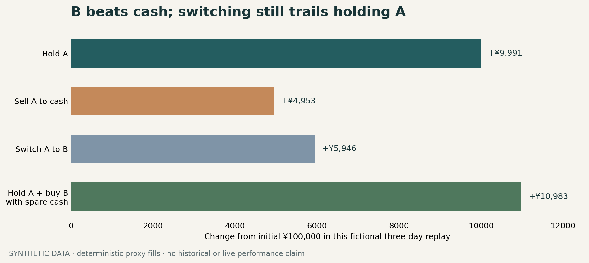

# Guanlan Quant · decisions before trades

**A runnable research slice of a larger A-share architecture.** Guanlan owns market facts, replay and simulated accounting. A continuing trader can ask whether to hold A, sell A, buy B, or switch A into B. Those are four different questions.

<p align="center"></p>

> **Synthetic example.** All prices and research notes in this repository are invented. The chart shows deterministic proxy fills, not historical performance, real orders, or a validated strategy.

## Try the complete research path

Requires Python 3.12+. From a fresh clone:

```bash
python -m venv .venv
# Windows: .venv\Scripts\activate
# macOS/Linux: source .venv/bin/activate
python -m pip install '.[test,jervis]'
python examples/run_research_cycle.py
python examples/run_experience_bridge.py
python -m pytest -q
```

The example writes inspectable artifacts to `.demo/research/`: a Q1 market snapshot and information cutoff, Q2 replay and diagnosis, Q3 research-context revisions, a Q4 **candidate only** manifest, a Q5 run record, and `result.json`. Use `--output <empty-directory>` to choose another output location. The example refuses to overwrite an existing run.

The synthetic result is deliberately uncomfortable: **B beats cash, but switching A into B trails holding A.** Existing cash can buy B without selling A. This is why the trader's sell, buy, and switch judgments must be evaluated independently under the same accounting assumptions.

The second command uses an **exact pinned public Jervis release**. It creates a separate Registry in `.demo/experience-bridge/`, saves a synthetic source and three candidate versions, resolves an old and a revised version by ID, verifies their attachments and cutoffs, then runs four fixed-action comparisons on another invented price path. Read `experience_versions.json`, `decision_packet.json`, and `retest.json` in that order. The later path happens to favor switching; neither result measures trader skill. [Follow the version binding and its limits](docs/jervis-bridge.md).

## What is actually exercised

| Boundary | Original module used in this release | Visible artifact |
| --- | --- | --- |
| **Q1 · market facts** | Snapshot readiness contract | `q1/market_snapshot.json`, `q1/window_readiness.json` |
| **Q2 · research and replay** | Snapshot adapter, unified event engine, diagnosis | `q2/scenario_results.json`, `q2/diagnosis.json` |
| **Q3 · serving context** | Research-context create/revise contract | `q3/research_context_versions.json` |
| **Q4 · structure learning** | Candidate manifest builder | `QUANT_WAREHOUSE/.../training_manifest.json` |
| **Q5 · platform control** | Run registry | `q5/runs/*.json` |

The Q1 snapshot is checked by Q2 against its content hash. The test changes one price after snapshot creation and confirms that Q2 refuses the mutated input. A small **public-fixture adapter** in the example admits a research note only when `available_at <= decision cutoff`; it does not claim to be the full private Q1 ingestion system. Q3 records a revised question rather than silently rewriting the original. Q4 reports `training_observation_count: 0`, `validation_status: not_eligible`, and `live_use: forbidden`. Q5 records the completed **research replay**, not an accepted investment decision.

### An end-to-end view

```text
invented time-bounded facts (Q1)
    → four separate simulated decisions + diagnosis (Q2)
    → revised research question (Q3)
    → non-promoted candidate record (Q4)
    → replay receipt (Q5)
```

## Where the continuing trader fits

The larger local project has a continuing trader identity, **Lu Dongyangzi / 路东阳紫**. Guanlan hosts its market queries, historical cases, replay and scheduling. Jervis holds source-linked, scoped experience for replaceable workers through its Registry/EventLog. A worker's proposed judgment returns to Guanlan for simulation and later diagnosis. A completed local diagnostic exam, targeted study and retest produced candidate revisions, but did **not** establish durable profitable trading or live authority.

The first public run exercises Guanlan's research boundaries with fixed signals. The optional second run resolves source-linked candidate versions through Jervis's real Registry and attachment check. **Neither invokes a Jervis worker, replays private trader experience, or proves a learned decision improves results.** The [Jervis public learning slice](https://github.com/Cornelius-Chen/Jervis) separately demonstrates how a tentative domain judgment is persisted, selected for a later task, or rejected by scope. The [portfolio Quant case](https://github.com/Cornelius-Chen/Cornelius-Chen/blob/main/cases/quant.md) explains the historical local trader loop and its evidence limits.

## Source and release boundary

The `src/a_share_quant/` modules are selected code from the existing Guanlan project: Q1 snapshot readiness; Q2 event replay, contracts, cost model and evidence; Q3 research context; Q4 candidate manifest; Q5 run registry; and shared market models. The Q4 function accepts an optional output root so the same module runs outside the private workspace. The Jervis reference resolver in Q2, both examples, tests, packaging, chart and this README were made for the public release. The two contract files under `examples/jervis_contracts/` are copied from the pinned Jervis release solely to initialize the isolated example Registry.

The original private market warehouse, account data, vendor data, exact strategy rules, worker transcripts and experiment registry are not distributed. This repository offers no broker connector or live-order path. No model is trained in the example. A research replay completing successfully is not evidence of trading skill or financial performance.

The code is published without an open-source license at this stage.
